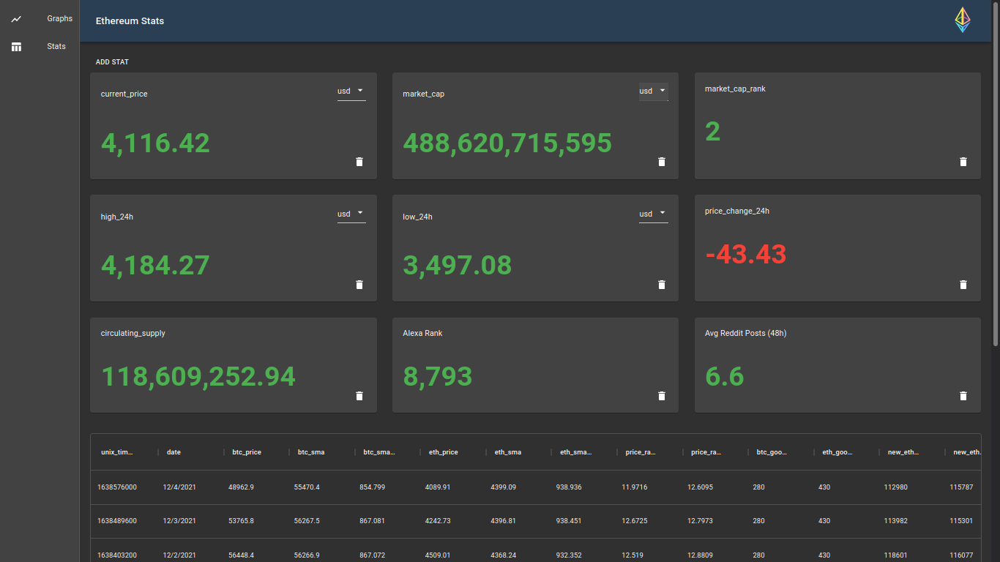
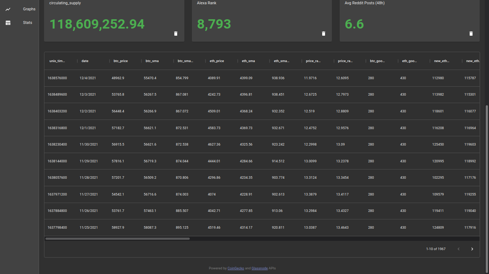
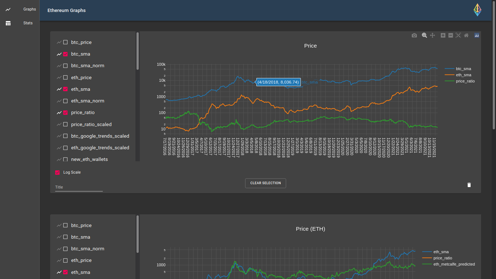
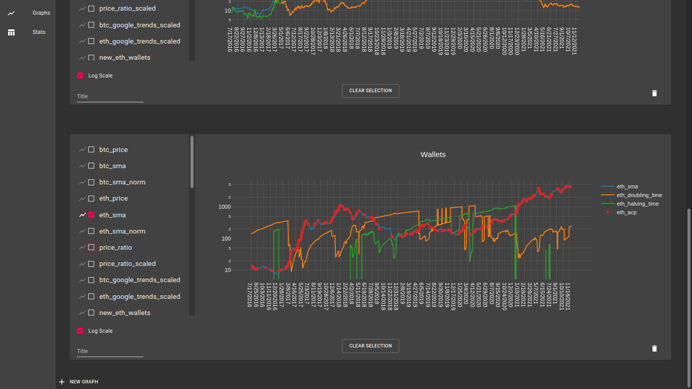

# eth-dashboard

Ethereum dashboard and graphing web application

[screenshots](#screenshots)

## Run locally (Linux)

Install [NodeJs](https://nodejs.org/en/), and create a Glassnode API [key](https://docs.glassnode.com/basic-api/api-key), then:

```sh
# clone the repo
git clone https://github.com/pranavgithub1/eth-dashboard.git
cd eth-dashboard

# add your glassnode API key to config
cd config
nano config.development.js
# edit line 15 to have your API key within the single quotes:
# config.api_key = 'your api key';

# install mysql and run setup.sql to create the database
cd ..
sudo apt install mysql-server
sudo mysql < setup.sql

# start the backend
cd eth-backend
npm install
cd server

node server.js
```

Now create a new terminal, and navigate to the folder where you ran `git clone`, then

```sh
cd eth-dashboard/eth-dashboard
npm install
# start the development server
npm start
```

Done!

The webapp is running on port 3000, and the backend is running on port 8080. You can change the backend port from the config. The frontend port is based on the create-react-app development server. You may notice the database is not up to date.

The backend has a route you can hit in order to update the databse (type this in your browser):

```
localhost:8080/api/v1/update
```

To stop the webapp, ctrl-c in both terminals, then stop the database with:

```sh
sudo service mysql stop
```

# Screenshots





